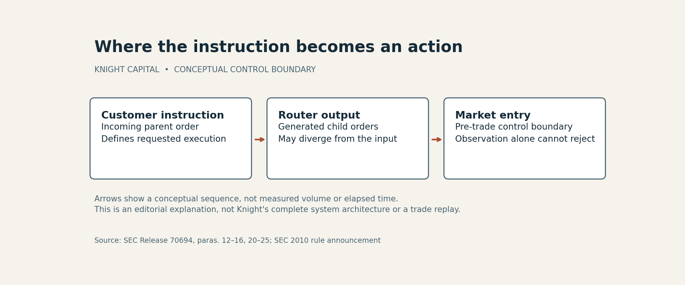

# Knight Capital evidence packet

Unapproved AI-assisted archival analysis. Selected official investigation, rule guidance and company-filing passages were inspected; no interview, legal opinion, complete-report review or human approval is claimed. `sources.json` links the factual groups to exact sources. The SEC order and announcement are the same investigation, not independent corroboration.

## Original diagram

The diagram explains why checking an incoming instruction does not establish safe outgoing behavior. Arrows encode sequence only, not speed, order volume or causal weights. It is not a reconstruction of Knight's complete architecture. Source locators and data are in `diagram_data.json`. No copied photograph, source figure or proprietary transaction data is used.

Reproduce from the repository root with Python 3 and Matplotlib 3.10.8:

    python content/research/generate_control_boundary.py

The article keeps trading loss, costs, penalty and financing separate. It does not add them to imply total economic damage. A consenting human editor and appropriate technical/financial review remain necessary before reader-site publication.
